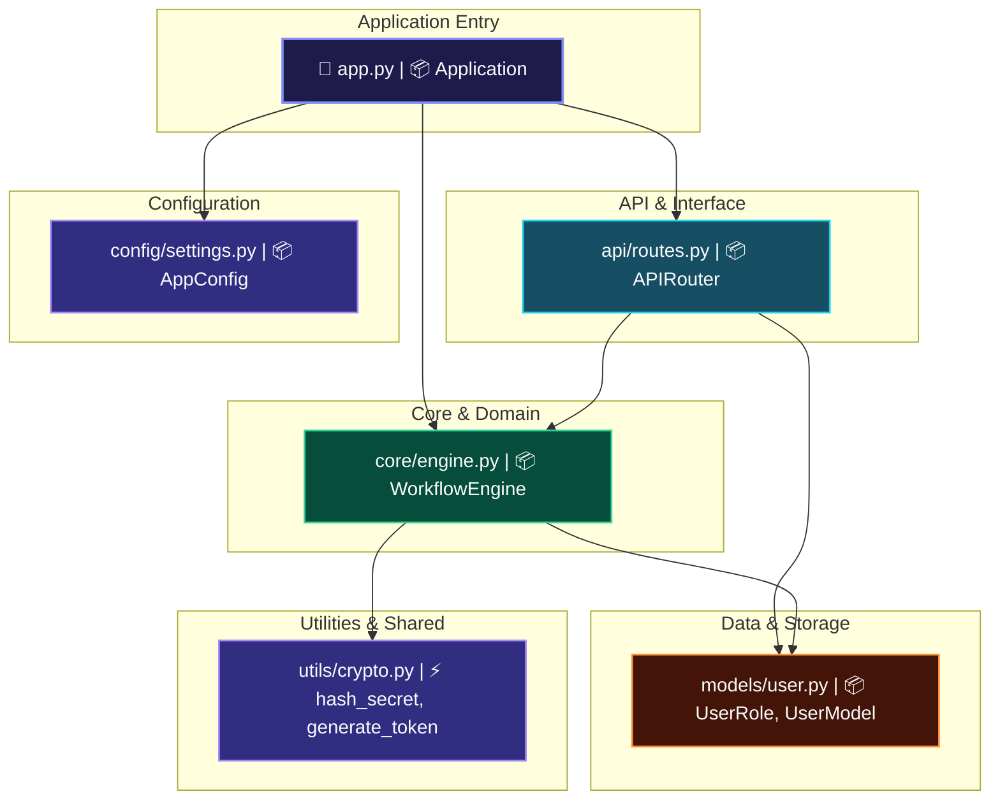

# Architecture Overview: demo_project

```mermaid
graph TD
  %% RepoGraph Architectural Blueprint
  classDef entryNode fill:#1e1b4b,stroke:#818cf8,stroke-width:2px,color:#f8fafc;
  classDef apiNode fill:#164e63,stroke:#22d3ee,stroke-width:1.5px,color:#f8fafc;
  classDef coreNode fill:#064e3b,stroke:#34d399,stroke-width:1.5px,color:#f8fafc;
  classDef dataNode fill:#431407,stroke:#fb923c,stroke-width:1.5px,color:#f8fafc;
  classDef utilNode fill:#312e81,stroke:#a78bfa,stroke-width:1.5px,color:#f8fafc;
  classDef defaultNode fill:#0f172a,stroke:#38bdf8,stroke-width:1.5px,color:#f8fafc;
  subgraph layer_Application_Entry["Application Entry"]
    app_py["🚀 app.py | 📦 Application"]:::entryNode
  end
  subgraph layer_API___Interface["API & Interface"]
    api_routes_py["api/routes.py | 📦 APIRouter"]:::apiNode
  end
  subgraph layer_Configuration["Configuration"]
    config_settings_py["config/settings.py | 📦 AppConfig"]:::utilNode
  end
  subgraph layer_Core___Domain["Core & Domain"]
    core_engine_py["core/engine.py | 📦 WorkflowEngine"]:::coreNode
  end
  subgraph layer_Data___Storage["Data & Storage"]
    models_user_py["models/user.py | 📦 UserRole, UserModel"]:::dataNode
  end
  subgraph layer_Utilities___Shared["Utilities & Shared"]
    utils_crypto_py["utils/crypto.py | ⚡ hash_secret, generate_token"]:::utilNode
  end
  app_py --> api_routes_py
  app_py --> config_settings_py
  app_py --> core_engine_py
  api_routes_py --> core_engine_py
  api_routes_py --> models_user_py
  core_engine_py --> models_user_py
  core_engine_py --> utils_crypto_py
```
